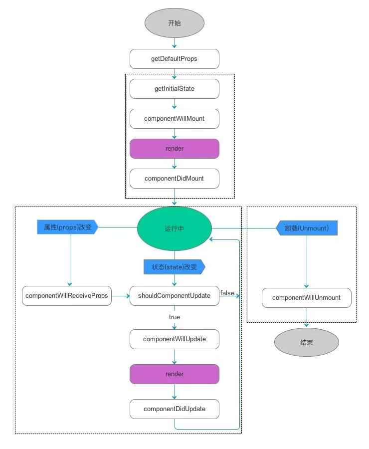

<h1><center>react-redux-antd</center></h1>

- [快速启动](#快速启动)
- [环境搭建](#环境搭建)
	- [1.使用create-react-app脚手架创建项目](#1使用create-react-app脚手架创建项目)
	- [2.添加antd组件库](#2添加antd组件库)
	- [3.下载react-router-dom路由](#3下载react-router-dom路由)
	- [4.下载redux库](#4下载redux库)
	- [添加Mock能力](#添加mock能力)
- [JSX](#jsx)
	- [关于JSX的{}](#关于jsx的)
- [关于css 模块化](#关于css-模块化)
- [router](#router)
- [redux和react-redux](#redux和react-redux)
- [react的生命周期](#react的生命周期)
	- [挂载卸载过程](#挂载卸载过程)
	- [更新过程](#更新过程)
	
### 快速启动
- 下载相关的包
	npm: `npm install`
	yarn: `yarn`
- 启动mock
	在项目根目录下打开node,运行`npm run mock`,默认监听端口号为8090,如果已被占用,请修改server.js和src/env.js中的端口号
- 启动项目
	在项目根目录下打开另一个node,运行`npm run start`,项目启动后自动打开浏览器
	
### 环境搭建

#### 1.使用create-react-app脚手架创建项目
```
npx create-react-app my-app
```
npx是node5.2以上版本附带的工具,低版本需要先全局安装create-react-app
```
npm install -g create-react-app
create-react-app my-app
```

#### 2.添加antd组件库
参考[antd官方文档](https://ant.design/docs/react/use-with-create-react-app-cn),写的比较详细

#### 3.下载react-router-dom路由
`npm install react-router-dom`

#### 4.下载redux库
`npm install react-redux`

#### 添加Mock能力
为了模拟前端想后端请求数据的过程,需要一个mockServer,现在的方案是单独开一个node作为mockServer  
之前直接将mock功能放在webpack的服务中,但因每次修改mock都需要重启webpack而放弃  
为了修改mock后,自动重启mockServer,需要添加node自动重启工具[nodemon.js](https://nodemon.io/)  
<span style="color: red">注</span>: 为何不用nodemon重启webpack?  webpack太重,重启太慢!  

添加依赖  
`npm install mockjs nodemon`  
未完待续....


### JSX
[JSX简介](https://react.docschina.org/docs/introducing-jsx.html)

#### 关于JSX的{}
在JSX中用{}包裹的会被认为是js表达式.  
示例:  
```
<div style={{color: '#fff',fontSize: '12px'}}>
  <p>{title}</p>
  <ul>
    {list.map((item) => {
      <li>{item}</li>
    })}
  </ul>
  {/*单行注释*/}
  {/*
    多行注释
    多行注释
    多行注释
  */}
</div>
```
- `style={{color: '#fff',fontSize: '12px'}}`,这里有两个{},含义不同.第一个是JSX的{},代表里面是一个js表达式,第二个表示这是个js对象  
这里样式的写法和在html中写行内样式不同,传入style的是一个对象,而不是字符串.xx-xx写法的样式都改成小驼峰  

- `{title}`,JSX的{},这里是个JS表达式
  
- ```
{list.map((item) => {
  <li>{item}</li>
})}
```
这里一共三个{},第一个是JSX的,第二个是js方法的,第三个是JSX的.  
这段代码相当于
```
  <li>{list[0]}</li>
  <li>{list[1]}</li>
  <li>{list[2]}</li>
  .........
```
- 单行注释和多行注释,略
- 如果需要在JSX内做复杂的js,建议定义一个新组件

### 关于css 模块化
在react中引入css有两种方式 `import './app.css'` 和 `import App from './app.module.css'`.前者是全局作用域的css引入方式,后者是局部css引入.  
对于局部引入的css,webpack打包时会生成一个map,用于存放实际class/id和打包后的class/id的映射.引入的App就是这个映射,`<div className={App.a}></div>`,在打包完成后,就相当于`<div className='a_xxx'></div>`.webpack就是以加特殊后缀的方式来实现css的模块化  
creat-react-app默认css打包配置(可以在`node_modules\react-scripts\config\webpack.config.js`中查看)
 - 以.css .sass .scss结尾的(不包含.module.css .module.sass .module.scss结尾),不会做模块化处理
 - 以.module.css .module.sass .module.scss结尾的,做模块化处理
 - 其他css预处理语言,需要自己手动配置
 
css文件位置应考虑就近原则
### router
[react-router官方文档](https://reacttraining.com/react-router/web/guides/quick-start)  
常用API及基本使用  
- Router: 最基础的路由组件,开发中Link.Redirect.Route等组件需要包裹在Router或者其他高阶路由组件中.一般在应用中使用高阶路由组件  
- HashRouter: 高阶路由组件,使用URL的哈希部分（即window.location.hash）来保持用户界面与URL同步  
- BrowserRouter: 高阶路由组件,使用HTML5的history API来保持用户界面与URL同步,需要server端支持才能使用  
- Link: 作用和html中的a标签类似.接受参数to,跳转的路由地址  
- Redirect: 重定向,接受两个参数,from和to.即将form的地址,重定向至to  
- Route: 路由渲染的出口,当地址能匹配路由中的path参数时,渲染组件到Route位置,参数excat,表示是否完全匹配  
- Switch: 和Route匹配使用,表示只渲染一个,不使用Switch,所有能匹配地址栏的路由都会渲染
- withRouter: 把不是通过路由切换过来的组件中,将react-router 的 history、location、match 三个对象传入props对象上

link,redirect,route,switch等组件必须在router组件或者router的高阶组件内使用
### redux和react-redux
基本介绍请看[redux中文文档](https://www.redux.org.cn/)
重点说明react-redux的使用方法  
(1)术语说明  
展示组件和容器组件
.jpg)
- action: 是把数据从应用传到 store 的有效载荷。它是 store 数据的唯一来源  
- reducer: 指定应用状态的变化如何响应actions并发送到store的  
- store: 
 - Store是把action和redurcer联系到一起的对象
 - 维持应用的 state  
 - 提供 getState() 方法获取 state
 - 提供 dispatch(action) 方法更新 state
 - 通过 subscribe(listener) 注册监听器
 - 通过 subscribe(listener) 返回的函数注销监听器。
 - 再次强调一下 Redux 应用只有一个单一的 store。当需要拆分数据处理逻辑时,你应该使用 reducer 组合 而不是创建多个 store。

(2)APi说明
- redux API
 - [中文api文档](http://cn.redux.js.org/docs/api/)
 - createStore: 创建一个store.接受参数reducer,返回store对象,也可以接受combineReducers方法组合后的reducer
 - combineReducers: 辅助函数,作用是把一个由多个不同 reducer 函数作为 value 的 object,合并成一个最终的 reducer 函数
- react-redux API
 - [中文api文档](https://www.redux.org.cn/docs/react-redux/api.html)
 - Provider: 作为组件存在,一般应该放在根组件外面.使组件层级中的 connect() 方法都能够获得 Redux store
 - 
```
ReactDOM.render(
  <Provider store={{name: 'aa'}}>
    <app />
  </Provider>,
  rootEl
)
```
- connect: 连接 React 组件与 Redux store。如果在根组件外面有Provider,可以直接使用,如果没有,需要把store通过props传递到使用connect的组件中  

(3)使用  
store管理数据状态,容器组件负责与store交互,展示组件负责渲染和用户交互.  
(4)流程  
- 同步action  
用户/系统触发展示组件的事件 => 容器组件调用action => reducer响应action,并修改store => store更新,触发ui更新  
- 异步action  
用户/系统触发展示组件的事件 => 容器组件调用action => action内部进行一步操作,异步完成后,调用同步action => reducer响应action,并修改store => store更新,触发ui更新  

为何不在组件内部进行异步操作,完成后调用同步action
- 便于管理,维护  
- 职责分开,react负责展示页面,redux负责处理数据  

### react的生命周期
React的生命周期从广义上分为三个阶段：挂载、渲染、卸载  
因此可以把React的生命周期分为两类：挂载卸载过程和更新过程。  
生命周期图

#### 挂载卸载过程
- constructor()  
constructor()中完成了React数据的初始化,它接受两个参数：props和context,当想在函数内部使用这两个参数时,需使用super()传入这两个参数。  
注意：只要使用了constructor()就必须写super(),否则会导致this指向错误。

- componentWillMount()  
componentWillMount()一般用的比较少,它更多的是在服务端渲染时使用。它代表的过程是组件已经经历了constructor()初始化数据后,但是还未渲染DOM时。

- componentDidMount()  
组件第一次渲染完成,此时dom节点已经生成,可以在这里调用ajax请求,返回数据setState后组件会重新渲染

- componentWillUnmount ()  
在此处完成组件的卸载和数据的销毁。
	- clear你在组建中所有的setTimeout,setInterval
	- 移除所有组建中的监听 removeEventListener
	
#### 更新过程
- componentWillReceiveProps (nextProps)  
在接受父组件改变后的props需要重新渲染组件时用到的比较多  
接受一个参数nextProps  
通过对比nextProps和this.props,将nextProps的state为当前组件的state,从而重新渲染组件  
```  
componentWillReceiveProps (nextProps) {
    nextProps.openNotice !== this.props.openNotice&&this.setState({
        openNotice:nextProps.openNotice
    },() => {
      console.log(this.state.openNotice:nextProps)
      //将state更新为nextProps,在setState的第二个参数（回调）可以打印出新的state
	})
}
```
- shouldComponentUpdate(nextProps,nextState)  
主要用于性能优化(部分更新)  
唯一用于控制组件重新渲染的生命周期,由于在react中,setState以后,state发生变化,组件会进入重新渲染的流程,在这里return false可以阻止组件的更新  
因为react父组件的重新渲染会导致其所有子组件的重新渲染,这个时候其实我们是不需要所有子组件都跟着重新渲染的,因此需要在子组件的该生命周期中做判断  
- componentWillUpdate (nextProps,nextState)  
shouldComponentUpdate返回true以后,组件进入重新渲染的流程,进入componentWillUpdate,这里同样可以拿到nextProps和nextState  

- componentDidUpdate(prevProps,prevState)  
组件更新完毕后,react只会在第一次初始化成功会进入componentDidmount,之后每次重新渲染后都会进入这个生命周期,这里可以拿到prevProps和prevState,即更新前的props和state

- render()  
render函数会插入jsx生成的dom结构,react会生成一份虚拟dom树,在每一次组件更新时,在此react会通过其diff算法比较更新前后的新旧DOM树,比较以后,找到最小的有差异的DOM节点,并重新渲染。  